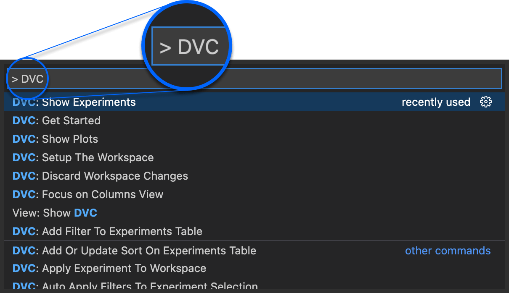

# Command Palette

> ℹ️ The extension's features cannot be accessed until DVC is installed and a
> DVC project is available in the workspace. Please refer to the
> [setup page](command:dvc.dvc.showDvcSetup) if you have not setup DVC yet.

This extension makes extensive use of the
[Command Palette](https://code.visualstudio.com/docs/getstarted/userinterface#_command-palette).
Which can be accessed via `F1` or ⇧⌃P on Windows/Linux or ⇧⌘P on macOS.

To see a list of available commands click [here](command:dvc.showCommands) or
type DVC into the Command Palette.

  

For further information on specific `dvc` commands, see the
[command-reference docs](https://dvc.org/doc/command-reference).
