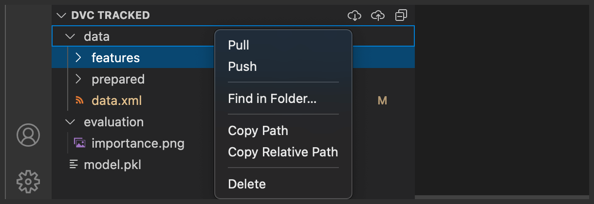
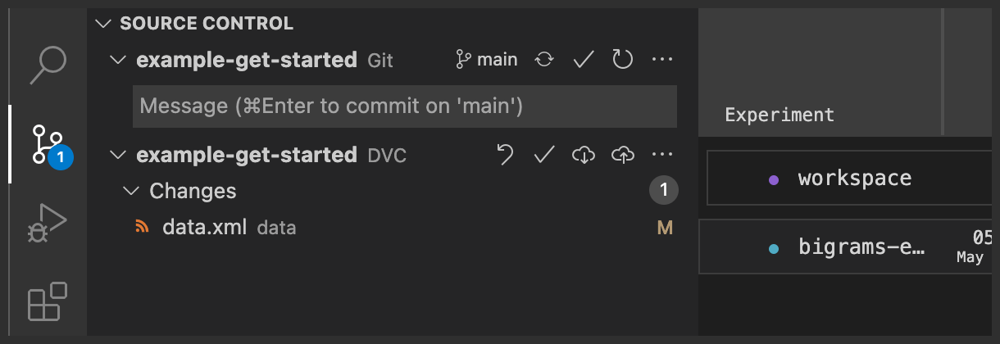

# Manage DVC-Tracked Files

> 💡 Read more about managing large files with Git and DVC
> [here](https://dvc.org/doc/start/data-management). DVC provides a few commands
> you can run along with `git` to version large files, directories, or ML model
> using external storages like S3, SSH, Google Cloud, etc.

In the [DVC Tracked View](command:dvc.views.trackedExplorerTree.focus) you can
see the files and directories that are managed by DVC (even if they are not yet
downloaded) in a view similar to the regular `Explorer` view

  

You can `dvc pull` to download your data or `dvc push` to save it right from
this view.

In the [Source Control View](command:workbench.view.scm) the statuses shown are
designed to integrate with that of the built-in Git extension and give an "at a
glance" state of the entire workspace. The extension will show if DVC-tracked
datasets are changed and you need to _commit_ them.

  

From this view you can trigger data management commands like `dvc checkout`,
`dvc commit`, as well as `dvc pull` and `dvc push`.
