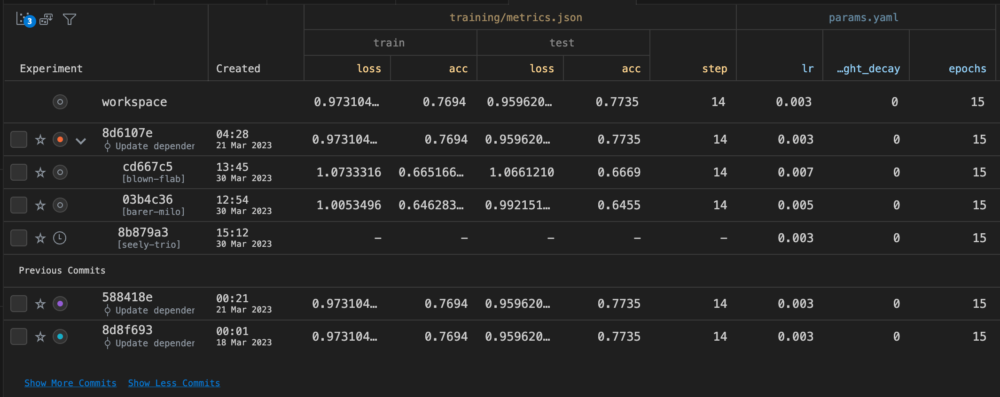

# Experiments Table

> ❗ DVC should be installed and DVC project available in the workspace for this
> and the next steps to work properly. Please refer to first two steps of this
> guide.

As you change code, parameters, data and run new experiments this table will
keep all the details about your iterations. It can be manipulated and configured
using the [DVC side panel](command:workbench.view.extension.dvc-views). This is
the extension's equivalent of the `dvc exp show` command.

  

Use `DVC: Show Experiments` from the
[Command Palette](command:workbench.action.quickOpen?%22>DVC:%20Show%20Experiments%22)
to open up the experiments table or access it, using the Columns view:

  

The table provides context menus to access basic operation on experiments and
table headers. You can edit parameters, sort or filter, run new experiments and
more:

  

