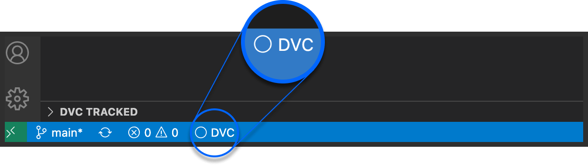
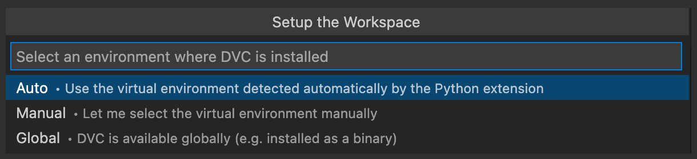

# Install DVC

There are a few [options](https://dvc.org/doc/install) for installing `DVC`.
This extension supports all installation types.

To verify the installation run `dvc -h` in a
[Terminal](command:workbench.action.terminal.new).

If DVC is installed as a global binary or in a Python virtual environment, the
extension would attempt to detect it automatically. If successful, you'll see a
DVC icon like this in the status bar:

  

If you see instead the crossed circle icon, use the
[Setup Workspace](command:dvc.setupWorkspace) wizard to manually select the
right environment:

  

