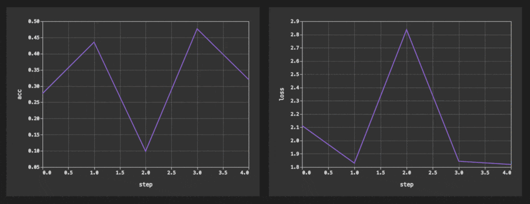

# Monitor your Experiments

As you run your experiments you can use the same
[`Plots Dashboard`](command:dvc.showPlots) to watch for the metrics and plot
updates:

<p align="center">
  
</p>

This functionality comes baked in when you update your plots files in your
training code. For example like this, using the
[DVCLive](https://dvc.org/doc/dvclive) library that also
[supports](https://dvc.org/doc/dvclive/ml-frameworks) many popular ML frameworks
to automate this process:

```python
from dvclive import Live

live = Live("training_metrics")

for epoch in range(NUM_EPOCHS):
    train_model(...)
    metrics = evaluate_model(...)

    for metric_name, value in metrics.items():
        live.log(metric_name, value)

 live.next_step()
```

`DVCLive` is _optional_, and you can just append or modify plot files using any
language and any tool.

💡 `Trends` section of the plots dashboard is being updated automatically based
on the data in the table. You don't even have to manage or write any special
plot files, but you need to enable
[checkpoints](https://dvc.org/doc/user-guide/experiment-management/checkpoints)
in the project.
