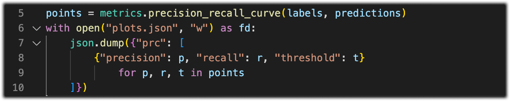
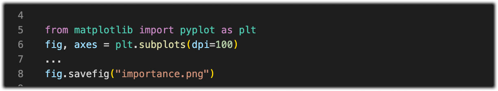
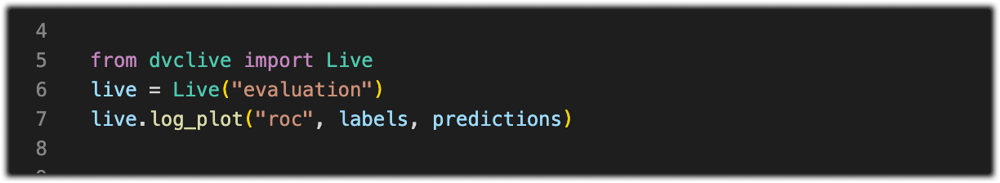
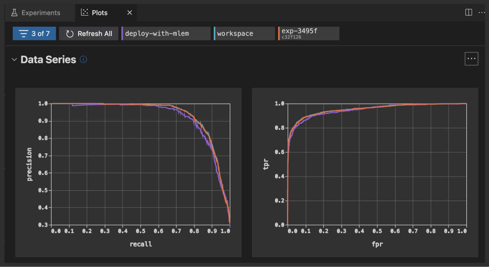
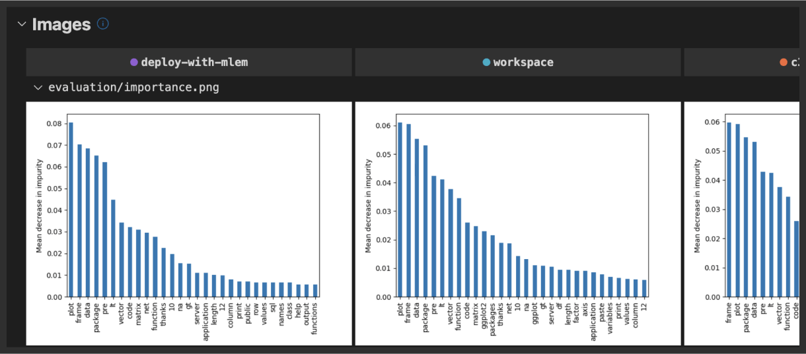
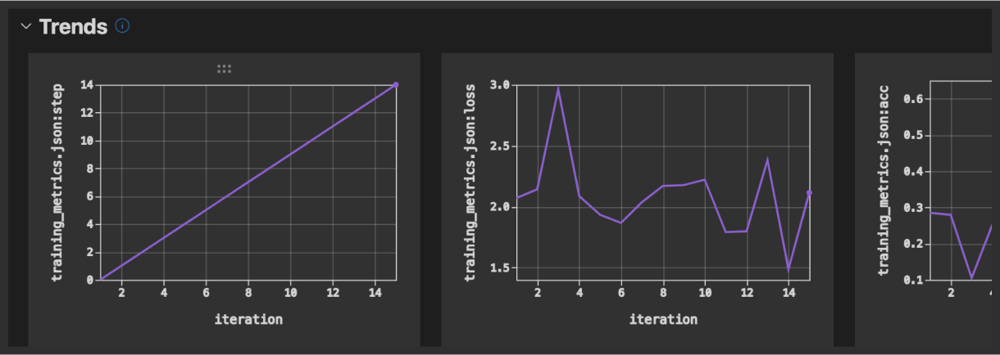
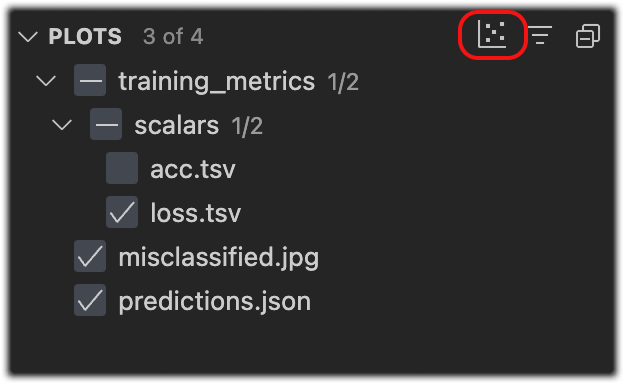
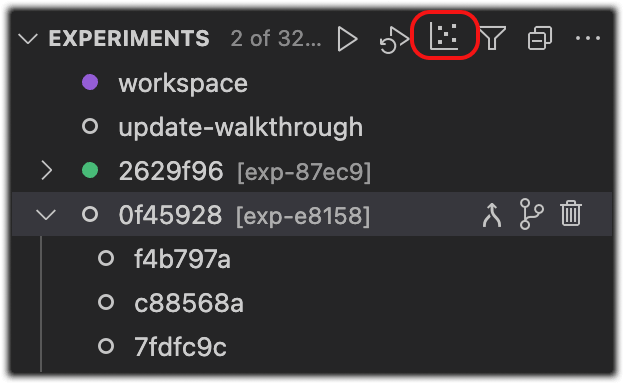

# Plots

Select one or more experiments to visualize in the
[**Plots Dashboard**](command:dvc.showPlots).

> This is equivalent to the [`dvc plots show`] and [`dvc plots diff`] commands.

[`dvc plots show`]: https://dvc.org/doc/command-reference/plots/show
[`dvc plots diff`]: https://dvc.org/doc/command-reference/plots/diff

💡 To add [DVC plots] to the project, start writing data series into JSON, YAML,
CSV, or TSV files; or save your own plot images (`.png`, etc.).

  
  

If you're using Python, the [DVCLive] helper library can save plots data for
you!

  

[dvc plots]: https://dvc.org/doc/start/experiments/visualization
[dvclive]: https://dvc.org/doc/dvclive

Use
[`DVC: Show Plots`](command:workbench.action.quickOpen?%22>DVC:%20Show%20Plots%22)
from the command palette to open the **Plots Dashboard**. It displays the
following types of plots (for the selected experiments).

## Data Series

  

JSON, YAML, CSV, or TSV files graphed using [plot templates], which may be
predefined (e.g. confusion matrix, linear) or custom ([Vega-lite] files)

[plot templates]:
  https://dvc.org/doc/command-reference/plots#plot-templates-data-series-only
[vega-lite]: https://vega.github.io/vega-lite/

  

## Images

  

Any image file (e.g. `.jpg` or `.svg`) can be visualized here. They will be
rendered side by side for the selected experiments.

## Trends

  
  

Real-time graphs based on scalar [metrics] from the **Experiments Table**;
available when you use [checkpoints]

The **Plots Dashboard** can be configured and accessed from the _Plots_ and
_Experiments_ side panels in the **DVC view**.

[metrics]: https://dvc.org/doc/command-reference/metrics
[checkpoints]: https://dvc.org/doc/user-guide/experiment-management/checkpoints
