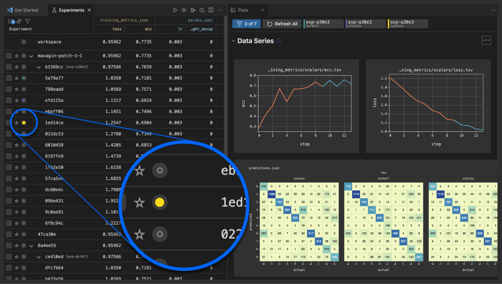

# Plots Dashboard

Select (click the circle beside the experiment name) up to 7 experiments in the
table view to visualize in the [**Plots Dashboard**](command:dvc.showPlots).

<p align="center">
  
</p>

Use
[`DVC: Show Plots`](command:workbench.action.quickOpen?%22>DVC:%20Show%20Plots%22)
from the command palette to open it or open it using the table's row context
menu.

[`dvc plots show`]: https://dvc.org/doc/command-reference/plots/show
[`dvc plots diff`]: https://dvc.org/doc/command-reference/plots/diff

💡 To add [DVC plots] to the project, start writing data series into JSON, YAML,
CSV, or TSV files; or save your own plot images (`.png`, etc.). If you're using
Python, the [DVCLive] helper library can save plots data for you!

```python
points = metrics.precision_recall_curve(labels, predictions)
with open("plots.json", "w") as fd:
     json.dump({"prc": [
          {"precision": p, "recall": r, "threshold": t}
               for p, r, t in points
     ]})
```

```python
from matplotlib import pyplot as plt
fig, axes = plt.subplots(dpi=100)
...
fig.savefig("importance.png")
```

```python
from dvclive import Live
live = Live("evaluation")
live.log_plot("roc", labels, predictions)
```

[dvc plots]: https://dvc.org/doc/start/experiments/visualization
[dvclive]: https://dvc.org/doc/dvclive

These are the types of plots that can be displayed (for the selected
experiments):

<p align="center">
  
</p>

**Data Series** are JSON, YAML, CSV, or TSV files visualized using [plot
templates], which may be predefined (e.g. confusion matrix, linear) or custom
([Vega-lite] files)

[plot templates]:
  https://dvc.org/doc/user-guide/experiment-management/visualizing-plots#plot-templates-data-series-only
[vega-lite]: https://vega.github.io/vega-lite/

<p align="center">
  
</p>

**Images** (e.g. `.jpg` or `.svg` files) can be visualized as well. They will be
rendered side by side for the selected experiments.

<p align="center">
  
</p>

**Custom** plots are generated linear plots comparing metrics and params. A user
can choose between two types of plots, "Checkpoint Trend" and "Metric Vs Param".
"Checkpoint Trend" plots compare a chosen [metric] value per epoch if
[checkpoints] are enabled and "Metric Vs Param" plots compare a chosen metric
and param across experiments.

[metric]: https://dvc.org/doc/command-reference/metrics
[checkpoints]: https://dvc.org/doc/user-guide/experiment-management/checkpoints

<p align="center">
  
</p>

The **Plots Dashboard** can be configured and accessed from the _Plots_ and
_Experiments_ side panels in the [**DVC View**](command:views.dvc-views).

> This is equivalent to the [`dvc plots show`] and [`dvc plots diff`] commands.
