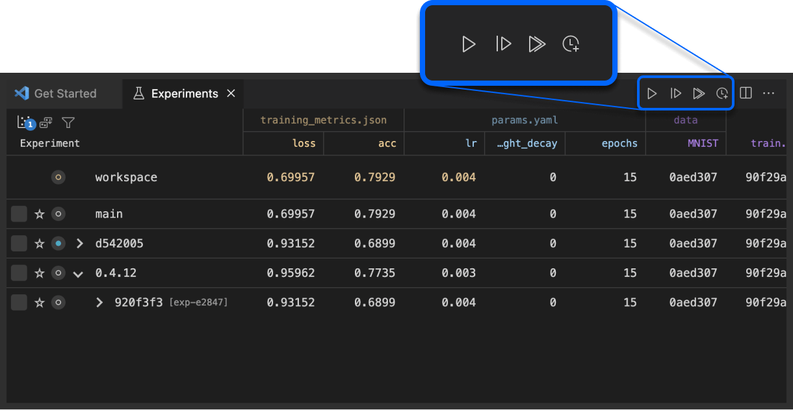

# Running Experiments

You edit your code, edit or add more data, applying a new combination of
hyperparameters- you have a new idea to try 💡!

This extension provides many different ways to run a new experiment or queue one
to be run later in the background or in parallel. This functionality wraps up
the [`dvc exp run`](https://dvc.org/doc/command-reference/exp/run) command.

The basic one is the set of buttons that are available when the experiments
table or parameters file are open:

  
  

After you are done modifying the project you can choose `Run`, `Queue`, or
`Run all`. As you do this you should see new items in the experiments table.

As usual, you can do the same and more from the context menus in the experiments
table, in the experiments View in the side bar, or via the command palette. For
example, we can take one of the existing experiments as a base, modify some
parameters and run/queue a new iteration:

  

