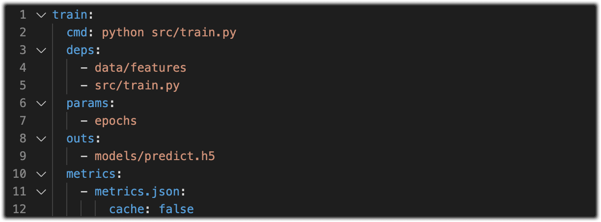
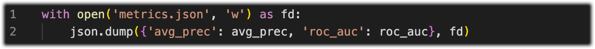
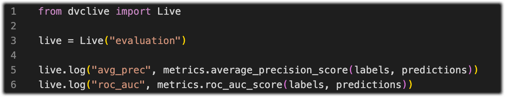

# Setup a DVC Project

> Skip this step if you already have a DVC project with metrics, plots, and
> params.

💡 Check out the
[DVC Get Started](https://github.com/iterative/example-get-started) or
[Extension Demo](https://github.com/iterative/vscode-dvc/tree/main/demo)
projects to quickly try the extension.

To quickly setup a new DVC project run
[`dvc exp init -i`](https://dvc.org/doc/command-reference/exp/init#example-interactive-mode)
in a [Terminal](command:workbench.action.terminal.new). It will generate a
config file `dvc.yaml` that describes the project, and will look something like
this:

  

💡 Names, values in this file are project dependent and can be customized.

DVC and this extension read experiments data from these files (e.g
`metrics.json`, `params.yaml`, etc). Your code needs to write and read to them
(the example below is Python, but it can be done in any language):

  

Alternatively, use the [`DVCLive`](https://dvc.org/doc/dvclive) Python library,
which can read and write a lot of different common metrics and plots:

  

