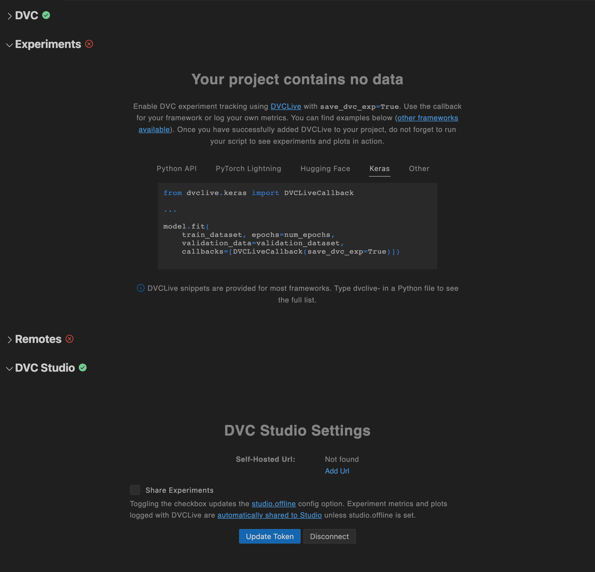

# Setup

The extension's key features cannot be accessed until DVC is installed and a DVC
project is available in the workspace. The
[setup page](command:dvc.showDvcSetup) can assist you with setting up your DVC
project, along with configuring additional features such as connecting to DVC
Studio and remotes.

  

Use `DVC: Show Setup` from the
[Command Palette](command:workbench.action.quickOpen?%22>DVC:%20Show%20Experiments%22)
to access it.
