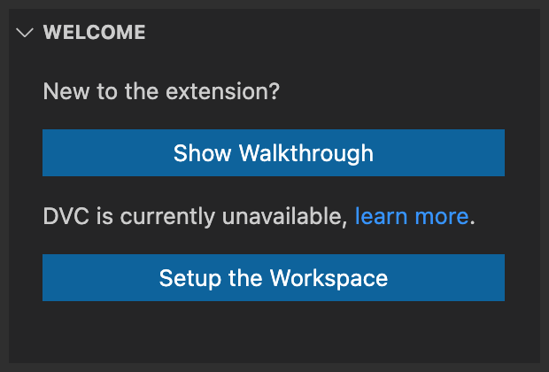
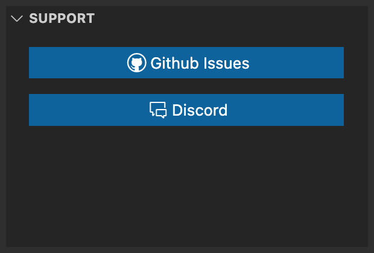
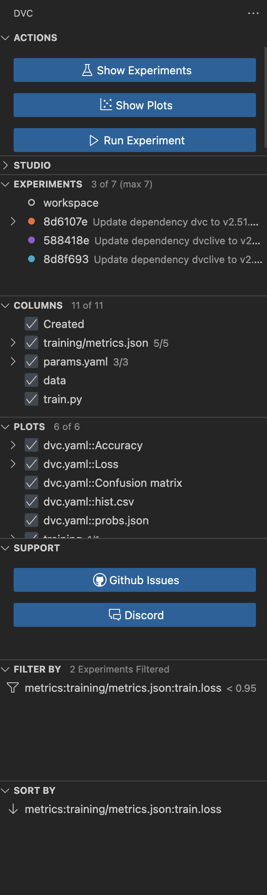

# DVC Views

Click on the `DVC` icon in the
[Activity Bar](https://code.visualstudio.com/docs/getstarted/userinterface) to
access the views or use
[View: Show DVC](command:workbench.view.extension.dvc-views) from the Command
Palette.

❗ Welcome and support views showing some getting started instructions will
appear in the container when `DVC` is not installed or if there is not a `DVC`
project available in the workspace:

  
  

> 🤗 If something goes wrong, you have a feature request, or you need some help-
> don't hesitate to ping us in the [Discord](https://discord.gg/BGCjJHvDHt)
> channel or open an issue on
> [GitHub](https://github.com/iterative/vscode-dvc/issues). We are happy to
> help.

If DVC and the extension are initialized, side bar will expose multiple views:

- `EXPERIMENTS`. Exposes the list of experiments and common actions.
- `COLUMNS`. Used to fine-tune the experiments table to focus on the most
  important metrics, parameters, and data signals and to view all available
  columns.
- `PLOTS`. Used to fine-tune the plots dashboard, e.g. by toggling plots
  visibility.
- `FILTER BY`. Used to view, add, or remove metrics and parameters filters.
- `SORT BY`. Used to display and configure how the experiments table is sorted.
  These will hide specific experiments in the table.
